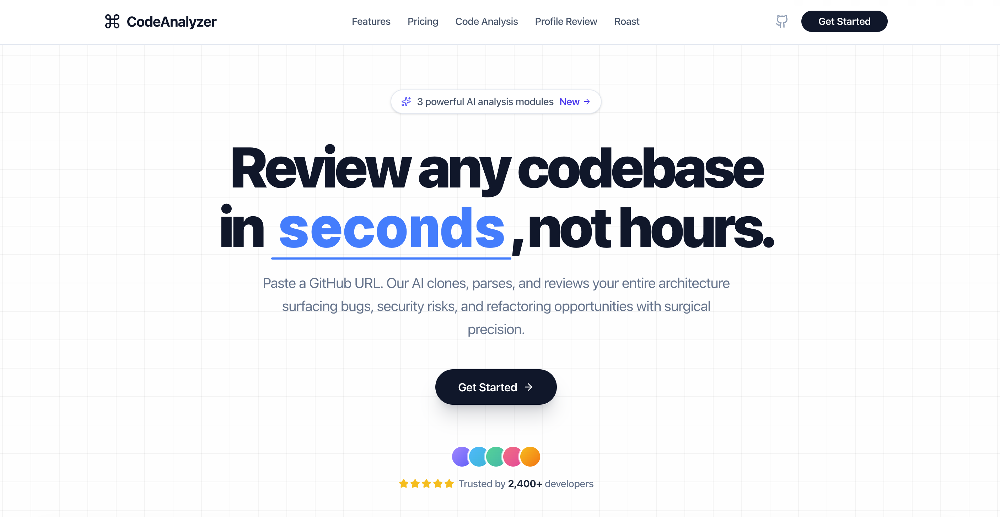

# AI Code Analyzer

A fast, self-hostable developer tool that uses LLMs to review GitHub repositories, assess developer profiles, and roast your commit history — with zero buzzwords.

Built with **Next.js 16**, **FastAPI**, **Groq**, and **FAISS**.

---

## Features

### 🔍 Repository Analysis
Paste any public GitHub URL and get a full AI code review in under 60 seconds. The backend clones the repo, builds a FAISS vector index, runs multi-query RAG retrieval, and sends packed context to `llama-3.3-70b-versatile` for structured analysis.

- Health score (0–100)
- Architecture pattern detection
- Bug list with file + line number, sorted by severity
- Improvement suggestions with implementation detail
- Code quality breakdown: readability, maintainability, test coverage estimate

### 👤 Profile Review
Enter a GitHub username and get an honest, no-buzzword profile assessment. The GitHub API data is scored across 6 technical axes and optionally expanded with 5 AI-generated improvement suggestions.

- Overall grade (A+ → F) with animated ring
- Language breakdown donut chart (up to 10 languages)
- 6-axis radar: Readability / Architecture / Testing / Documentation / Consistency / Open Source
- Hireability index with strengths and gaps
- 5 prioritised AI suggestions with effort estimates

### 💀 Profile Roast
A comedian's take on your GitHub profile. Cruel, specific, and oddly motivating. Results are shareable as a card.

---

## Screenshots & Demo

### Landing page


## Video Demos

### Repository Analysis Workflow
https://github.com/tusharmishra069/Github-Analyzer/assets/repo-analyzer.mp4

### Profile Review Dashboard
https://github.com/tusharmishra069/Github-Analyzer/assets/profile.mp4

### Profile Roast Generation
https://github.com/tusharmishra069/Github-Analyzer/assets/roast.mp4

---

## Tech Stack

**Frontend**


**Backend**


---

## Quick Start

### Prerequisites

- Node.js 20+
- Python 3.11+
- A [Groq API key](https://console.groq.com) (free)
- A [Neon Postgres](https://neon.tech) database (free tier works)

### 1. Clone

```bash
git clone https://github.com/your-username/github-analyzer.git
cd github-analyzer
```

### 2. Backend Setup

```bash
cd backend
python -m venv .venv
source .venv/bin/activate
pip install -r requirements.txt
```

Create `backend/.env`:

```env
GROQ_API_KEY=gsk_...
DATABASE_URL=postgresql://...   # Neon pooled connection string
GITHUB_TOKEN=ghp_...            # Optional — raises rate limit to 5000 req/hr
```

Start the API:

```bash
uvicorn main:app --reload --port 8000
```

### 3. Frontend Setup

```bash
cd frontend
npm install
```

Create `frontend/.env.local` (optional — defaults to localhost):

```env
NEXT_PUBLIC_API_URL=http://localhost:8000
```

Start the dev server:

```bash
npm run dev
```

Open [http://localhost:3000](http://localhost:3000).

---

## API Reference

| Method | Endpoint | Description |
|---|---|---|
| `GET` | `/` | Health check |
| `POST` | `/api/analyze` | Queue a repository analysis job |
| `GET` | `/api/jobs/{job_id}/status` | Poll job progress and result |
| `POST` | `/api/profile-review` | Generate profile review |
| `POST` | `/api/profile-suggestions` | Generate 5 AI profile suggestions |
| `POST` | `/api/roast` | Generate profile roast |

Full interactive docs available at `http://localhost:8000/docs` when running locally.

### Example — Analyze a Repo

```bash
# Queue job
curl -X POST http://localhost:8000/api/analyze \
  -H "Content-Type: application/json" \
  -d '{"repository_url": "https://github.com/owner/repo"}'
# → {"job_id": "abc-123", "status": "PENDING", "message": "Job queued"}

# Poll status
curl http://localhost:8000/api/jobs/abc-123/status
# → {"status": "COMPLETED", "progress": 100, "result": {...}}
```

### Example — Profile Review

```bash
curl -X POST http://localhost:8000/api/profile-review \
  -H "Content-Type: application/json" \
  -d '{"username": "torvalds"}'
```

---

## Project Structure

```
github-analyzer/
├── backend/
│   ├── main.py                        App factory — mounts routers, CORS
│   ├── requirements.txt
│   └── app/
│       ├── core/
│       │   ├── config.py              Settings singleton (env vars, limits)
│       │   └── database.py            SQLAlchemy engine + session + get_db()
│       ├── models/
│       │   └── job.py                 Job ORM model
│       ├── schemas/
│       │   ├── analysis.py            Request/response schemas for repo analysis
│       │   └── profile.py             Schemas for roast, review, suggestions
│       ├── api/
│       │   └── routes/
│       │       ├── analysis.py        POST /api/analyze · GET /api/jobs/{id}/status
│       │       └── profile.py         POST /api/roast · /profile-review · /profile-suggestions
│       └── services/
│           ├── worker.py              Background task — clone → parse → embed → analyze
│           ├── repo_parser.py         Git clone + file filtering
│           ├── ai_engine.py           Multi-query RAG pipeline (FAISS + Groq)
│           ├── github_service.py      GitHub REST API wrapper
│           ├── profile_review_generator.py  Profile review + AI suggestions
│           └── roast_generator.py     Comedy roast generator
├── frontend/
│   └── src/
│       ├── app/
│       │   ├── page.tsx               Landing page
│       │   ├── repo-analysis/         Repo analysis tool
│       │   ├── profile-review/        Profile review dashboard
│       │   └── profile-roast/         Roast generator
│       └── components/
│           ├── Features.tsx           Landing page feature cards
│           ├── ProfileReviewDashboard.tsx
│           ├── ThreeDScene.tsx
│           └── ui/                    shadcn/ui components
└── docs/
    ├── about.md
    ├── system-architecture.md
    ├── database.md
    ├── deployment.md
    ├── testing.md
    └── add_on_features.md
```

---

## Documentation

| Doc | Description |
|---|---|
| [docs/about.md](docs/about.md) | Project overview, module descriptions, design philosophy |
| [docs/system-architecture.md](docs/system-architecture.md) | Architecture diagrams, request flows, AI pipeline |
| [docs/database.md](docs/database.md) | Schema, state machine, result JSON structure |
| [docs/deployment.md](docs/deployment.md) | Local setup, Vercel/Railway/Render deployment, env vars |
| [docs/testing.md](docs/testing.md) | Run commands, API testing |
| [docs/add_on_features.md](docs/add_on_features.md) | Planned features and roadmap |

---

## License

MIT
